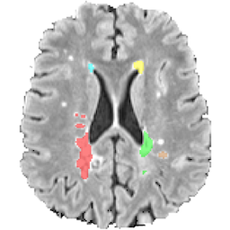

<!-- README.md is generated from README.Rmd. Please edit that file -->

# Lesion Quantification Toolkit (LQT) 

`LQT` is an R implementation of the lesion quantification toolkit, based
on the paper [“Lesion Quantification Toolkit: A MATLAB software tool for
estimating grey matter damage and white matter disconnections in
patients with focal brain
lesions”](https://www.biorxiv.org/content/10.1101/2020.07.28.225771v1)
by Griffis et al. This package creates data structures necessary for
applying the method to imaging data, then allows the user to perform the
analyses, summarize the results, and create figures for visualization.

## Installation

To get the latest development version from GitHub:

``` r
devtools::install_github('jdwor/LQT')
```

[](https://travis-ci.com/jdwor/LQT)

## Functions

Below is a list of the functions and a description of options available
to utilize through the `LQT` package. An example of how to run the
analysis from beginning to end is given below, in the “Vignette”
section.

### get.mmdt.obj

This function creates an ‘mmdt object’ from vectors of nifti filenames,
subject IDs, and subject group memberships. This information is compiled
into a data structure that can be entered into the ‘mmdt’ function to
perform the analysis.

``` r
get.mmdt.obj(masks, modal1, modal2, modal3=NULL,
             modal4=NULL, modal5=NULL, modal6=NULL,
             ids, groups, parallel=TRUE, cores=2, pb=TRUE)
```

*Arguments*

  - `masks` A vector of class  that gives .nii or .nii.gz filenames for
    subjects’ masks. Masks demarcate which voxels should be included in
    the analysis, and are coded by TRUE/FALSE or 1/0.
  - `modal#` Vectors of class  that give .nii or .nii.gz filenames for a
    given imaging modality across subjects. At least two modalities
    (modal1 and modal2) must be entered. Up to 6 can be included.
  - `ids` A vector of subject ids. Must be the same length as the
    filenames in the ‘modal\#’ vectors.
  - `groups` A vector of group membership. Must be two categories, and
    should be the same length as ‘ids’.
  - `parallel` A logical value that indicates whether the user’s
    computer should run the code in parallel.
  - `cores` If parallel = TRUE, cores is an integer value that indicates
    how many cores the function should be run on.
  - `pb` A logical value that indicates whether or not a progress bar
    will be shown during analysis.

### mmdt

This function runs the multi-modal density test (mmdt) using an mmdt
object obtained from ‘get.mmdt.obj’.

``` r
mmdt(mmdt.obj, mins=NULL, maxs=NULL,
     gridsize=NULL, H=NULL, mc.adjust="BH",
     nperm=500, parallel=TRUE, cores=2, pb=TRUE)
```

*Arguments*

  - `mmdt.obj` An mmdt object obtained using the ‘get.mmdt.obj’
    function.
  - `mins` A vector giving the lower intensity bounds for each modality.
    If NULL, lower bounds will be set to the minimum observed value for
    each modality.
  - `maxs` A vector giving the upper intensity bounds for each modality.
    If NULL, upper bounds will be set to the maximum observed value for
    each modality.
  - `gridsize` A vector giving the number of points along each dimension
    at which the densities should be evaluated and tested. If NULL, this
    value defaults to 151x151 for two modalities, 51x51x51 for three,
    and 21x21x21x21 for four. Must be specified manually when analyzing
    4-6 modalities.
  - `H` The bandwidth matrix used for kernel density estimation. If
    NULL, a plug-in bandwidth estimator is used.
  - `mc.adjust` A character vector giving the multiple comparison
    adjustments to use. Default is “BH”, which controls FDR using the
    Benjamini-Hochberg procedure. The additional options are: “BY”,
    which controls FDR using the Benjamini-Yekutieli procedure, “maxt”,
    which controls FWER using max-t correction, and “tfce”, which
    controls FWER using threshold-free cluster enhancement. Both of the
    latter options use permutation to determine significance.
  - `nperm` If mc.adjust contains either ‘maxt’ or ’tfce, this is an
    integer value that gives the number of permutations desired to
    estimate the null distribution.
  - `parallel` A logical value that indicates whether the user’s
    computer should run the code in parallel.
  - `cores` If parallel = TRUE, cores is an integer value that indicates
    how many cores the function should be run on.
  - `pb` A logical value that indicates whether or not a progress bar
    will be shown during analysis.

### summarize.mmdt

This function outputs a summary of the mmdt output, printing whether or
not there were significant differences after adjustment for multiple
comparisons, and giving the approximate locations of differences within
the density space.

``` r
summarize.mmdt(mmdt.results)
```

*Arguments*

  - `mmdt.results` An object resulting from the ‘mmdt’ command.

### fig.mmdt

This function creates visualizations of the mmdt results (either a
t-statistic map or a significance map).

``` r
fig.mmdt(mmdt.results, type="significance", 
         mc.adjust="BH", coords=c(NA,NA))
```

*Arguments*

  - `mmdt.results` An object resulting from the ‘mmdt’ command.
  - `type` Type of image to be produced. Can be “t-statistic” or
    “significance”. Default is “significance”.
  - `mc.adjust` If type=“significance”, this states which adjustment
    method to use for visualization.
  - `coords` If more than two modalities were used to create
    ‘mmdt.results’ object, this gives a vector of length d \[e.g.,
    c(NA, NA, 3.25) for d=3\] giving the coordinates at which the plane
    should be visualized. Entries should be “NA” for the two modalities
    to be plotted along the x and y axes, and other entries should give
    the value along the each other dimensions at which the results
    should be visualized.

### mmdt.to.brain

This function maps mmdt results back onto subjects’ brain image domains
for visualization and exploration purposes.

``` r
mmdt.to.brain(mmdt.results, type="t-statistic", mc.adjust="BH",
              mask, modal1, modal2, modal3=NULL, modal4=NULL,
              modal5=NULL, modal6=NULL)
```

*Arguments*

  - `mmdt.results` An object resulting from the ‘mmdt’ command.
  - `type` Type of image to be produced. Can be “t-statistic” or
    “significance”. Default is “significance”.
  - `mc.adjust` If type=“significance”, this states which adjustment
    method to use to determine significance.
  - `mask` A string that gives a .nii or .nii.gz filename for the given
    subject’s mask. Masks will demarcate which voxels will be included,
    should be coded by TRUE/FALSE or 1/0, and should be the same as the
    masks used to conduct the mmdt analyses.
  - `modal#` Strings that give a .nii or .nii.gz filename for a
    subject’s given imaging modality. At least two modalities (modal1
    and modal2) must be entered. Up to 6 can be included. The same
    modalities used in the mmdt analyses should be entered here, in the
    same order.

## Vignette

The following gives a simple example of how the functions provided in
this package should be used to conduct and summarize the multi-modal
density test.

First, an data object should be created using the `mmdt.obj` function.
In this example, we have four subjects, with IDs from 1 to 4. The first
two subjects are in group 1, and the last two subjects are in group 2.
We can create the mmdt.obj object as follows:

``` r
masks = c("mask01.nii", "mask02.nii", "mask03.nii", "mask04.nii")
t1s = c("t101.nii", "t102.nii", "t103.nii", "t104.nii")
flairs = c("flair01.nii", "flair02.nii", "flair03.nii", "flair04.nii")
ids = c(1, 2, 3, 4)
groups = c(1, 1, 2, 2)

mmdt.obj = get.mmdt.obj(masks = masks, modal1 = t1s, modal2 = flairs,
                        ids = ids, groups = groups)
```

Once we have the mmdt.obj object, we can carry out the analysis using
the `mmdt` function. Here, we will use the defaults for several values,
and will therefore not enter them in the function call. We will use the
defaults for 1) `mins` and `maxs`, which will perform the test over the
full space of voxel intensity values, 2) `gridsize`, which uses the a
151x151 grid for two modalities, and 3) the KDE bandwidth `H`, which
uses a plug-in estimator for each subject.

For the values that we will enter manually, we will correct for multiple
comparisons using both Benjamini-Hochberg (for FDR control), and max-t
correction with 500 permutations (for FWER control). We will also run
the function in parallel, on four cores, with a progress bar.

``` r
mmdt.results = mmdt(mmdt.obj, mc.adjust = c("BH", "maxt"), nperm = 500, 
                    parallel = TRUE, cores = 4, pb = TRUE)
```

Once we have the ‘mmdt.results’ object in hand, we can summarize the
results using the `summarize.mmdt` function. Here, we simply call the
function with the ‘mmdt.results’ object, and it prints our results to
the console.

``` r
summarize.mmdt(mmdt.results)
```

We can then create vizualization of these results using the `fig.mmdt`
function. We will first visualize the t-statistic map, and then the
significance map with Benjamini-Hochberg correction. Since we only used
two modalities (T1 and FLAIR), we do not need to enter anything for the
‘coords’ parameter.

``` r
tfig = fig.mmdt(results, type = "t-statistic")
tfig

sfig = fig.mmdt(results, type = "significance", mc.adjust = "BH")
sfig
```

Finally, if we want to manually check where the relevant voxel intensity
profiles tend to be located in the brain, we can use the `mmdt.to.brain`
function to map the t-statistics or significance values back onto the
subjects’ brain masks used to run the analysis. We would do this one at
a time for each subject, and the example below shows how we would do
this for Subject 1. First, we will create a nifti image in which voxels
are assigned the t-statistic of their location in the density space, and
then we will create a nifti image in which voxels are labeled if they
are located at a region of the density space in which there was a
significant group difference.

``` r
tstat.mask.s1 = mmdt.to.brain(mmdt.results, type = "t-statistic",
                              mask = "mask01.nii", modal1 = "t101.nii",
                              modal2 = "flair01.nii")
writeNifti(tstat.mask.s1, file="mmdt.tstat.01.nii.gz")

sig.mask.s1 = mmdt.to.brain(mmdt.results, type = "significance",
                            mask = "mask01.nii", modal1 = "t101.nii",
                            modal2 = "flair01.nii")
writeNifti(sig.mask.s1, file="mmdt.sig.01.nii.gz")
```

There you have it\! Feel free to reach out to
jdwor\[at\]pennmedicine\[dot\]upenn\[dot\]edu if you have any questions
about the package. This page will be updated with more information when
the MMDT paper is published and publicly available.
