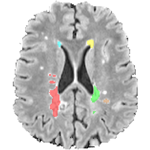
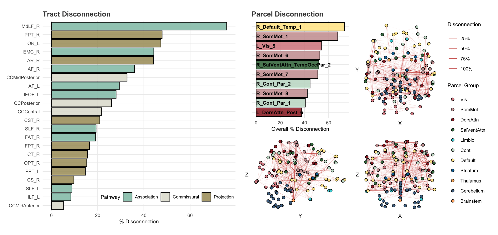
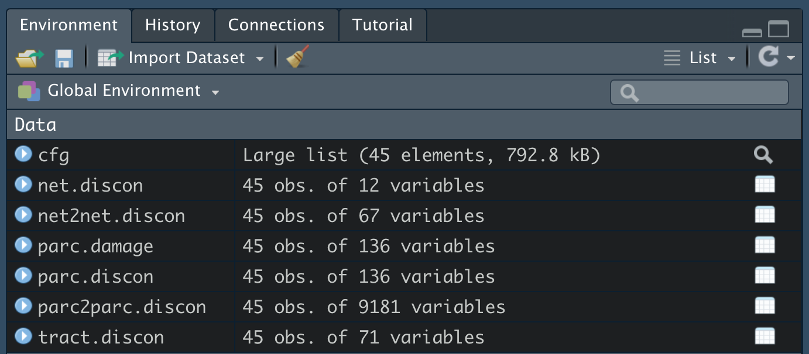

<!-- README.md is generated from README.Rmd. Please edit that file -->

# Lesion Quantification Toolkit (LQT) 

**Note: This package is no longer being actively maintained! I will still try to answer questions, but as dependencies get updated some things might get buggy as time passes. I recommend looking into Amy Kuceyeski's NeMo tool instead (https://github.com/kjamison/nemo)**

---

`LQT` is an R implementation of the lesion quantification toolkit, based
on the paper [“Lesion Quantification Toolkit: A MATLAB software tool for
estimating grey matter damage and white matter disconnections in
patients with focal brain
lesions”](https://www.sciencedirect.com/science/article/pii/S2213158221000838)
by Griffis et al. The LQT is “a publicly available software package for
quantifying the structural impacts of focal brain lesions. It uses
atlas-based approaches to estimate parcel-level grey matter lesion loads
and multiple measures of white matter disconnection severity that
include tract-level disconnection measures, voxel-wise disconnection
maps, and parcel-wise disconnection matrices. The toolkit also estimates
lesion-induced increases in the lengths of the shortest structural paths
between parcel pairs, which provide information about changes in
higher-order structural network topology.”

The R package creates data structures necessary for applying the methods
directly to MNI-registered lesion maps from either a single patient or a
full study. The package then allows the user to create figures for
visualization and summary, and to compile analysis-ready datasets for
research.

## Installation

To get the latest development version from GitHub:

``` r
devtools::install_github('jdwor/LQT')
```

[](https://travis-ci.com/jdwor/LQT)

## Usage

Below is a description of the included functions and their usage,
alongside examples of how an analysis would be run from beginning to
end. The repository also contains two example files
(“Example\_Multi\_Patient\_Script.R” and
“Example\_Single\_Patient\_Script.R”) that can be downloaded, edited,
and run locally.

### create\_cfg\_object

This function creates a configuration (cfg) object that contains
relevant information on file locations, parcellation choices, and
parameter options for downstream analyses. At minimum, the user
specifies either a single patient ID or a vector of patient IDs, as well
as either a single lesion mask file path or a vector of lesion mask file
paths corresponding to the patient ID(s) and in MNI space. The user also
specifies an output path to which results and images will be saved.

Additional options include ‘parcel\_path’, which allows a user to
specify a path to a 1mm MNI parcellation image, ‘file\_suffix’, which
allows a user to specify naming conventions for the output files,
‘node\_label’ and ‘node\_group’, which allow users to provide
additional parcellation information (though these are automatically
loaded when using the built-in Schaefer-Yeo atlases), as well as
additional visualization and specification options (see
?create\_cfg\_object for more information).

``` r
########### Set up config structure ###########
pat_ids = paste0("Subject", 1:45)
lesion_paths = list.files('/Users/JaneGoodall/Study/LesionMasks',
                          full.names = TRUE)
parcel_path = system.file("extdata","Schaefer_Yeo_Plus_Subcort",
                          "100Parcels7Networks.nii.gz",package="LQT")
out_path = '/Users/JaneGoodall/Study/Results'

cfg = create_cfg_object(pat_ids=pat_ids,
                        lesion_paths=lesion_paths,
                        parcel_path=parcel_path,
                        out_path=out_path)
```

### get\_parcel\_damage

This function takes a pre-built cfg object and estimates the amount of
damage sustained by each brain region. Regions are defined by the
parcellation file path provided in ‘create\_cfg\_object’. The cfg object
is the only input to this function, and the desired number of cores can
be specified if the cfg object includes multiple subjects. The function
saves three files to the output directory, 1) a nifti lesion mask, 2) a
nifti damage map, giving the % of each parcel that overlapped lesion
voxels, and 3) a csv with the percent damage to each parcel.

### get\_tract\_disconnection

This function computes tract-based disconnection measures, with tracts
defined by the HCP-842 tractography atlas as described in Yeh et al.,
(2018 - NeuroImage). The cfg object is the only input to this function,
and the desired number of cores can be specified if the cfg object
includes multiple subjects. The function saves one file to the output
directory, a csv with the (probabilistic) % disconnection of each tract.

### get\_parcel\_cons

This is a wrapper that calls a series of functions to create various
parcel disconnection measures. It wraps the ‘get\_parcel\_atlas’,
‘get\_atlas\_sspl’, ‘get\_parcel\_discon’, and ‘get\_patient\_sspl’
functions, checking whether atlas connectivity measures have been
calculated and then running the study-specific disconnectivity
assessments. This function creates four directories: “Atlas” -
containing connectivity matrices and measures based on the given
parcellation and the HCP 842 tracts; “Parcel\_Disconnection” -
containing patient-specific matrices and measures of probabilistic
lesion-based disconnectivity between parcels; “Parcel\_SSPL” -
containing patient-specific matrices of increased structural shortest
path length between parcels; and “Disconnection\_Maps” - containing
nifti images showing voxel-level and streamline-level disconnectivity.

``` r
########### Create Damage and Disconnection Measures ###########
# Get parcel damage for patients
get_parcel_damage(cfg, cores=2)
# Get tract SDC for patients
get_tract_discon(cfg, cores=2)
# Get parcel SDC and SSPL measures for patients
get_parcel_cons(cfg, cores=2)
```

### plot\_lqt\_subject

This function constructs subject-level visualizations of lesion-based
damage and disconnection. For cfg objects with a single subject, the
user only needs to specify the plot type. For cfg objects with multiple
subjects, the user needs to specify the ID of the desired subject (or
their numeric index) as well as the plot type. Plot type options are
“parcel.damage”, which gives a barplot of percent parcel damage;
“tract.discon”, which gives a barplot of percent tract-level
disconnection; “parcel.discon”, which gives a barplot and brain network
plots showing parcel-level disconnection; and “parcel.sspl”, which gives
a barplot and brain network plots showing parcel-level structural
shortest path length increases.

``` r
########### Build and View Summary Plots ###########
plot_lqt_subject(cfg, "Subject1", "parcel.damage")
plot_lqt_subject(cfg, "Subject1", "tract.discon")
plot_lqt_subject(cfg, "Subject1", "parcel.discon")
plot_lqt_subject(cfg, "Subject1", "parcel.sspl")
```

<p align="center">



</p>

### compile\_data

This function reads in completed LQT results files and compiles
analysis-ready datasets. The user provides the relevant config object
(cfg), and can additionally specify the number of cores for the function
to be run on. The function returns a list object containing several
analysis-ready datasets, in which rows represent patients and columns
represent lesion metrics: “parc.damage”, which gives percent regional
parcel damage across subjects; “tract.discon”, which gives percent tract
disconnection across subjects; “net.discon”, which gives the percent
disconnection for each parcel group or network across its edges;
“parc.discon”, which gives the percent disconnection for each
individual parcel across its edges; “net2net.discon”, which gives the
percent disconnection of each pairwise network-to-network edge;
“parc2parc.discon”, which gives the percent disconnection of each
pairwise parcel-to-parcel edge. These datasets each contain an ID column
to facilitate merging with clinical data. Note that some of these
datasets will have many columns, and some columns might have very little
(or no) variance across subjects.

``` r
########### Compile Datasets for Analysis ###########
data = compile_data(cfg, cores = 2)
list2env(data, .GlobalEnv); rm(data)
```

<p align="center">



</p>

There you have it\! Good luck with your research, and don’t hesitate to
email me at jordandworkin \[at\] gmail \[dot\] com if
you have any questions about the package.
